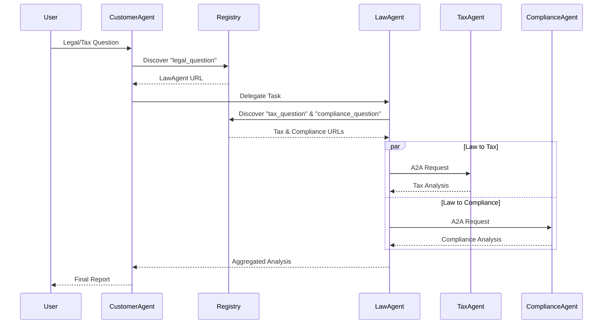

# Sequence Diagram - A2A Multi-Agent System

```mermaid
sequenceDiagram
    participant User
    participant CustomerAgent
    participant Registry
    participant LawAgent
    participant TaxAgent
    participant ComplianceAgent

    User->>CustomerAgent: Legal/Tax Question
    CustomerAgent->>Registry: Discover "legal_question"
    Registry-->>CustomerAgent: LawAgent URL
    CustomerAgent->>LawAgent: Delegate Task
    LawAgent->>Registry: Discover "tax_question" & "compliance_question"
    Registry-->>LawAgent: Tax & Compliance URLs
    par Law to Tax
        LawAgent->>TaxAgent: A2A Request
        TaxAgent-->>LawAgent: Tax Analysis
    and Law to Compliance
        LawAgent->>ComplianceAgent: A2A Request
        ComplianceAgent-->>LawAgent: Compliance Analysis
    end
    LawAgent-->>CustomerAgent: Aggregated Analysis
    CustomerAgent-->>User: Final Report
```
